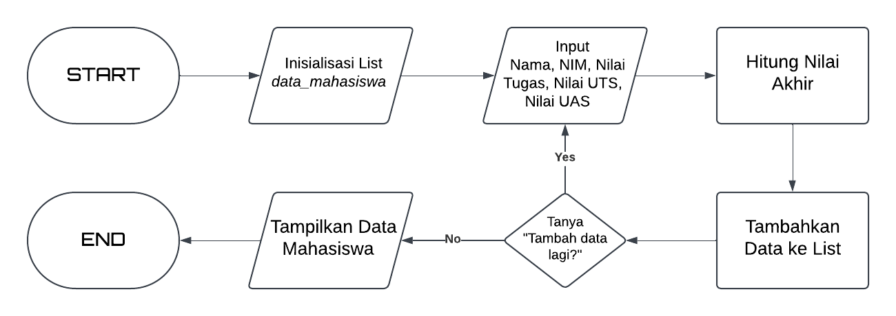

# Praktikum5
Pada praktikum ke 5 ini, tugas yang diberikan adalah membuat sebuah program yang dapat menginput data nilai dari mahasiswa dan membuat flowchart dari program tersebut

## Flowchart

Ini adalah flowchart dari program yang akan dibuat

## Program
### 1. Inisialisai List

data_mahasiswa [],digunakan untuk menyimpan data mahasiswa dalam bentuk dictionary.

### 2. Input Data

Ini digunakan sebagai program untuk meminta data dari user. Sebagai contoh disini kita akan memasukkan Nama, NIM, Nilai Tugas, Nilai UTS, dan Nilai UAS.

### 3. Perhitungan Nilai Akhir

Pada Section ini Nilai akan dihitung dengan bobot Nilai Tugas = 30%, Nilai UTS = 35%, dan Nilai UAS = 35%

### 4. Menambahkan data ke List

Data yang diinputkan oleh User seperti Nama, NIM, Nilai Tugas, Nilai UTS, dan Nilai UAS akan dimasukkan kedalam list data_mahasiswa[]

### 5. Perulangan

Program akan menanyakan apakah User ingin menambah data baru atau tidak. Jika Ya, maka Program akan meminta data dari Nama Namun jika tidak program akan langsung menampilkan hasil dari data yang diinputkan.

### 6. Tampilkan Data

Setelah meminta data dan sudah tidak ada data lagi yang dimasukkan maka serangkaian print() akan dijalankan agar membentuk suatu output data nilai mahasiswa sesuai yang diinginkan.

## Output

Berikut ini adalah output dari program yang sudah dibuat, sebagai contoh saya disini menggunakan nama Sapto, Juna, Ilham, Ikan, dan Sangkuriang. dan dapat dilihat semua data yang kita masukkan pada input akan tertata secara rapih dan bagus.

# Terima Kasih